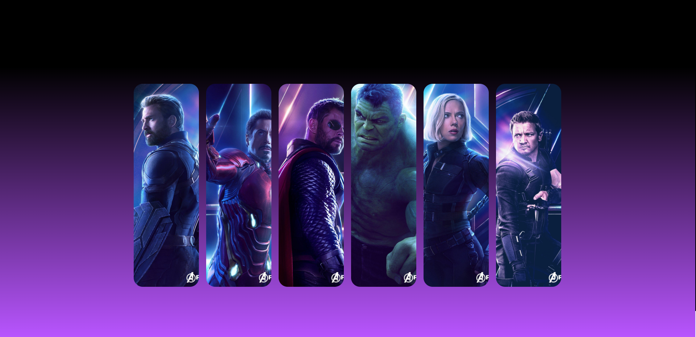
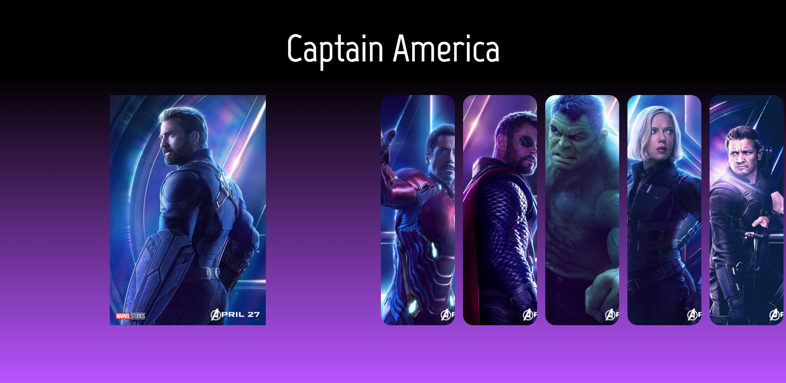

# Information about the project

#### Project name: Avengers - expanding cards
#### Technologies: HTML, CSS, JavaScript
#### Creation time: Fifth semester of computer science studies
#### Purpose of creation: Practising HTML, CSS, JavaScript - Self education
#### Author(s): Kajetan Gałęziowski 

# Preview and description

#### Live-preview: https://dreamy-bartik-35d34d.netlify.app/

Simple design, expanding cards with Avengers photos and straightforward JavaScript for animation effects for panels and header.
